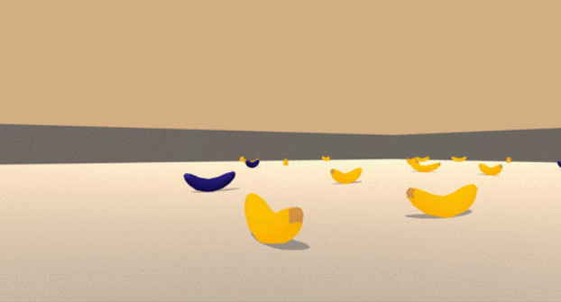
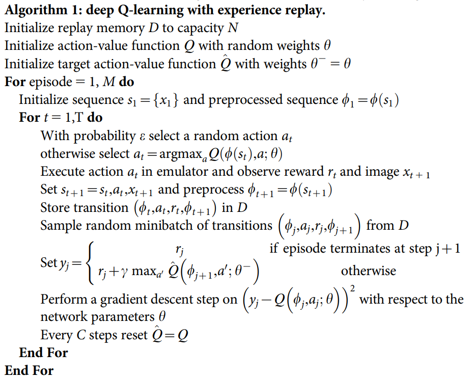
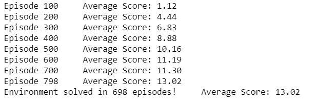
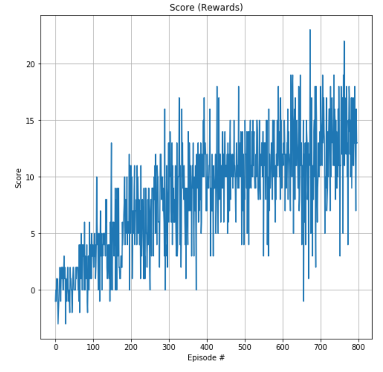

# Report of Udacity Deep Reinforcement Learning Nanodegree Project 1: Navigation

This is my report for [Udacity Deep Reinforcement Learning Nanodegree](https://www.udacity.com/course/deep-reinforcement-learning-nanodegree--nd893) Project 1: Navigation.

## Goal of the project

In this Navigation project, the goal is to train an agent to navigate in a virtual world and collect as many yellow bananas as possible while avoiding blue bananas.



### Environment details

The environment is based on [Unity ML-agents](https://github.com/Unity-Technologies/ml-agents). Unity ML-Agents is an open-source Unity plugin that enables games and simulations to serve as environments for training intelligent agents.

**Note:** The Unity ML-Agent team frequently releases updated versions of their environment. We are using the v0.4 interface. The project environment provided by Udacity is similar to, but not identical to the [Banana Collector](https://github.com/Unity-Technologies/ml-agents/blob/master/docs/Learning-Environment-Examples.md#banana-collector) environment on the Unity ML-Agents GitHub page.

A reward of +1 is provided for collecting a yellow banana, and a reward of -1 is provided for collecting a blue banana. Thus, the goal of your agent is to collect as many yellow bananas as possible while avoiding blue bananas.

The state space has 37 dimensions and contains the agent's velocity, along with ray-based perception of objects around the agent's forward direction. Given this information, the agent has to learn how to best select actions. Four discrete actions are available, corresponding to:

- 0 - move forward.
- 1 - move backward.
- 2 - turn left.
- 3 - turn right.

The task is episodic, and in order to solve the environment, **the agent must get an average score of +13 over 100 consecutive episodes**.

## Agent details

### Deep Q-Learning

This project implements a value-based deep reinforcement learning method called Deep Q-Learning. In fact, a Deep Q-Learning algorithm is built by a Deep Q-Network (DQN).

Generally speaking, Deep Q-Learning combines 2 parts together:
- A reinforcement learning method called [Q Learning (or SARSA max)](https://en.wikipedia.org/wiki/Q-learning)
- Deep neural networks to learn an approximation of Q-table (action-values)

Besides, this implementation includes the 2 major training improvements by [Deepmind](https://deepmind.com) which describes the implementation in their [Nature publication: "Human-level control through deep reinforcement learning (2015)"](https://storage.googleapis.com/deepmind-media/dqn/DQNNaturePaper.pdf)
- Experience Replay 
> When the agent interacts with the environment, the sequence of experience tuples can be highly correlated. The naive Q-learning algorithm that learns from each of these experience tuples in sequential order runs the risk of getting swayed by the effects of this correlation. By instead keeping track of a replay buffer and using experience replay to sample from the buffer at random, we can prevent action values from oscillating or diverging catastrophically. The replay buffer contains a collection of experience tuples *(S, A, R, S')*. The tuples are gradually added to the buffer as we are interacting with the environment. The act of sampling a small batch of tuples from the replay buffer in order to learn is known as experience replay. In addition to breaking harmful correlations, experience replay allows us to learn more from individual tuples multiple times, recall rare occurrences, and in general make better use of our experience.

- Fixed Q-Targets
> In Q-Learning, we update a guess with a guess, and this can potentially lead to harmful correlations. In TD error calculation, target function is changed frequently with deep neural networks. Unstable target function makes training difficult. So Q-Target Network technique fixes parameters of target function and replaces them with the latest network every desired updating steps.

### Algorithm

According to the [paper](https://storage.googleapis.com/deepmind-media/dqn/DQNNaturePaper.pdf) of Deepmind, Deep Q-Learning algorithm is shown below.


As for my Project1 Navigation, I implemented Deep Q-Learning algorithm according to [Udacity Deep Reinforcement Learning Nanodegree course](https://www.udacity.com/course/deep-reinforcement-learning-nanodegree--nd893)


### Code implementation

The codes consist of 3 files:

- `model.py`: In this python file, a PyTorch QNetwork class is implemented. This is a fully connected Deep Neural Network using the [PyTorch Framework](https://pytorch.org/docs/0.4.0/). This network will be trained to predict the action depending on the environment observed states. This Neural Network is used by the DQN agent and is composed of :
  - the input layer whose size depends on the state_size
  - 2 fully connected hidden layers of 1024 neurons each
  - the output layer whose size depends on the action_size 
  - the activation function is RELU function for each node of the hidden layers
  
- `DQN_agent.py`: In this python file, a DQN agent and a Replay Buffer are defined:
  - The DQN agent class is built according to the Deep Q-Learning algorithm. It contains several functions:
    - constructor: 
      - Initializes 2 Neural Networks: the target network and the local network
      - Initializes the Replay Buffer
      - Initializes time step
    - step(): 
      - Stores a step taken by the agent (state, action, reward, next_state, done) in the Replay Buffer
      - If there are enough samples available in the Replay Buffer, the agent updates the weights of target network with the current weight values from the local network (Fixed Q-Targets)
    - act():
        Returns actions for the given state as per current policy (Epsilon-greedy action selection)
    - learn():
        Updates value parameters using given batch of experience tuples from the Replay Buffer
    - soft_update():
        Is called by learn() to softly update the value of the target network from the local network (Fixed Q-Targets)
  - The ReplayBuffer class implements a fixed-size buffer to store experience tuples (state, action, reward, next_state, done) and contains several functions:
    - constructor: 
        Initializes a ReplayBuffer object
    - add():
        Adds a new experience to memory
    - sample():
        Randomly samples a batch of experience from memory and returns (state, action, reward, next_state, done)
    - __ len __():
        Returns the current size of internal memory
    
- `Navigation.ipynb` : In this Jupyter Notebook file, we can train the agent. More specifically, it is able to:
  - Import the necessary packages 
  - Check the state and action spaces
  - Take random actions in the environment
  - Train an agent using Deep Q-Learning
  - Plot the scores/rewards

### Hyperparameters

The DQN agent uses the following hyperparameters:

```
BUFFER_SIZE = int(1e5)  # replay buffer size
BATCH_SIZE = 64         # minibatch size 
GAMMA = 0.995           # discount factor 
TAU = 1e-3              # for soft update of target parameters
LR = 5e-4               # learning rate with the Adam optimizer
UPDATE_EVERY = 4        # how often to update the network
```

The Neural Networks use the following architecture:

```
Input Layer (37 nodes) -> 
Fully Connected Hidden Layer (1024 nodes, relu activation function) -> 
Fully Connected Hidden Layer (1024 nodes, relu activation function) -> 
Ouput Layer (4 nodes)
```

## Result
With all these hyperparameters and Neural Networks, the result is quite good:





**The result satisfies the goal of this project as the agent is able to receive an average reward (over 100 episodes) of at least +13, and in 698 episodes only**. (According to Udacity benchmark implementation, the environment should be solved in fewer than 1800 episodes.)

## Ideas for future work

Firstly, according to the Udacity course, a further evolution to this project would be to train the agent directly from the environment's observed raw pixels instead of using the environment's internal states (37 dimensions). In order to solve this environment, a [Convolutional Neural Network](https://en.wikipedia.org/wiki/Convolutional_neural_network) should be added at the input of the network with the purpose of processing the raw pixels values.

Secondly, we could improve the performance of the agent with some Deep Q-Learning improvements:
- [Double DQN](https://arxiv.org/abs/1509.06461)
> **Abstract**: The popular Q-learning algorithm is known to overestimate action values under certain conditions. It was not previously known whether, in practice, such overestimations are common, whether they harm performance, and whether they can generally be prevented. In this paper, we answer all these questions affirmatively. In particular, we first show that the recent DQN algorithm, which combines Q-learning with a deep neural network, suffers from substantial overestimations in some games in the Atari 2600 domain. We then show that the idea behind the Double Q-learning algorithm, which was introduced in a tabular setting, can be generalized to work with large-scale function approximation. We propose a specific adaptation to the DQN algorithm and show that the resulting algorithm not only reduces the observed overestimations, as hypothesized, but that this also leads to much better performance on several games.

- [Prioritized Experience Replay](https://arxiv.org/abs/1511.05952)
> **Abstract**: Experience replay lets online reinforcement learning agents remember and reuse experiences from the past. In prior work, experience transitions were uniformly sampled from a replay memory. However, this approach simply replays transitions at the same frequency that they were originally experienced, regardless of their significance. In this paper we develop a framework for prioritizing experience, so as to replay important transitions more frequently, and therefore learn more efficiently. We use prioritized experience replay in Deep Q-Networks (DQN), a reinforcement learning algorithm that achieved human-level performance across many Atari games. DQN with prioritized experience replay achieves a new state-of-the-art, outperforming DQN with uniform replay on 41 out of 49 games.

- [Dueling DQN](https://arxiv.org/abs/1511.06581)
> **Abstract**: In recent years there have been many successes of using deep representations in reinforcement learning. Still, many of these applications use conventional architectures, such as convolutional networks, LSTMs, or auto-encoders. In this paper, we present a new neural network architecture for model-free reinforcement learning. Our dueling network represents two separate estimators: one for the state value function and one for the state-dependent action advantage function. The main benefit of this factoring is to generalize learning across actions without imposing any change to the underlying reinforcement learning algorithm. Our results show that this architecture leads to better policy evaluation in the presence of many similar-valued actions. Moreover, the dueling architecture enables our RL agent to outperform the state-of-the-art on the Atari 2600 domain.

Last but not least, researchers at Google DeepMind recently tested the performance of an agent that incorporated Double DQN (DDQN), Prioritized Experience Replay, Dueling DQN, Learning from Multi-Step Bootstrap Targets, Distributional DQN, Noisy DQN all together. The corresponding algorithm was termed **Rainbow**. It outperforms each of the individual modifications and achieves state-of-the-art performance on Atari 2600 games!
- [Rainbow](https://arxiv.org/abs/1710.02298)
> **Abstract**: The deep reinforcement learning community has made several independent improvements to the DQN algorithm. However, it is unclear which of these extensions are complementary and can be fruitfully combined. This paper examines six extensions to the DQN algorithm and empirically studies their combination. Our experiments show that the combination provides state-of-the-art performance on the Atari 2600 benchmark, both in terms of data efficiency and final performance. We also provide results from a detailed ablation study that shows the contribution of each component to overall performance.
